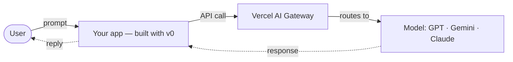

# Beginner guide

Never built an AI app? Start here. You'll have a live app before you write real code.

## You only build the top bit

An AI app has layers — the hardware, the AI model, the platform that serves it, then your app on top. **You only build the top.** Vercel and the AI Gateway handle the servers, the models (GPT, Claude, Gemini…), and the plumbing. You focus on the idea and the experience.

Here's the whole request flow — what happens when someone uses your app:

You build the box on the left; the Gateway and the model are a one-line swap away.

## Before the hackathon (~1 hour)

1. Create a **[Vercel account](https://vercel.com/signup)** and a **[v0](https://v0.dev)** account.
2. Get an **AI Gateway API key** — see [AI SDK guide](ai-sdk-guide.md#get-a-model-key).
3. Build one tiny app on **[v0.dev](https://v0.dev)** and click **Deploy**. That's the whole loop.

## Your first hour

1. Pick a scoped idea from [Challenges](challenges.md).
2. Copy a small example or clone a matching starter — see [starter templates](ai-sdk-guide.md#starter-templates).
3. Deploy it and open the live URL in a private/incognito window to confirm it works.

## Your first day

- Replace the template's content and logic with your idea.
- Add **one** thing that makes it useful: a tool call or a data source ([AI SDK guide](ai-sdk-guide.md)).
- Keep scope tight — aim to demo ~25% of the big idea, done well.

## Make it visible to judges

Judges need your **live URL** and to **see the code**, so deploy your app and put it on GitHub as a **public** repo (or share your v0 project link). Both easy paths start on v0 — the same two ways as the [Start building](/start-building) page:

- **All on v0 + Vercel (no local setup)** — build on [v0.dev](https://v0.dev), click **Deploy** for a live URL, then **Push to GitHub** and set the repo public.
- **Start on v0, then refine locally** — build on v0 and **Push to GitHub**, pull the repo to your machine to edit in your own editor, and publish from Vercel when you're ready.

Both keep v0 and Vercel connected for you, so you skip the fiddly "import a repo into Vercel" step.

Pushing to GitHub also **backs up your work** — do it early and keep pushing, so a closed tab or spent credits never costs you the project.

Keep secrets out of a public repo — never commit `.env.local` or keys. More in the [Deployment guide](deployment-guide.md).

## The one rule

Deploy early and often. A live URL that does one thing beats a perfect app on your laptop.

It's 2 weeks, part-time: **deploy something small in week 1, then improve it in week 2.** Don't wait until it's "ready" to ship.

Stuck? See the [FAQ](faq.md), or ask in the [🆘 Help](https://teams.microsoft.com/l/channel/19%3A04b6a2068e4248bd85e0c34288a4d4e5%40thread.tacv2/%F0%9F%86%98%20Help?groupId=e292c5cf-9c44-4ee6-ace4-bc4bbfa60d6c&tenantId=76a2ae5a-9f00-4f6b-95ed-5d33d77c4d61) channel.
