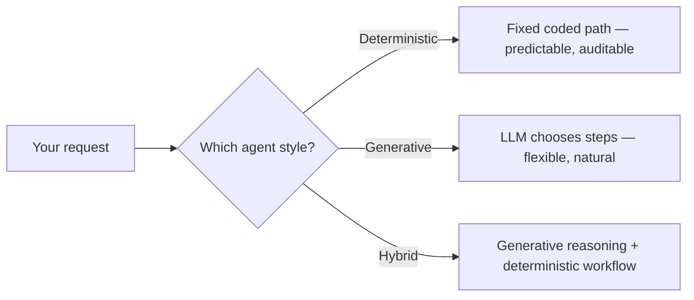

# FAQ

Quick answers, grouped by topic. Jump to a question below.

## Contents

**Getting started**
1. [Do I need to know how to code?](#1-do-i-need-to-know-how-to-code)
2. [Who can join? Do I need to be a developer?](#2-who-can-join-do-i-need-to-be-a-developer)
3. [Do I need to register, and by when?](#3-do-i-need-to-register-and-by-when)
4. [Do I need a team, or can I go solo?](#4-do-i-need-a-team-or-can-i-go-solo)
5. [What does it cost?](#5-what-does-it-cost)
6. [How much time do I need to commit?](#6-how-much-time-do-i-need-to-commit)
7. [How finished does my project need to be?](#7-how-finished-does-my-project-need-to-be)

**Understanding the concepts**
8. [How does a generative AI app fit together?](#8-how-does-a-generative-ai-app-fit-together)
9. [What's a foundation model, and why are there different ones for images, video, and speech?](#9-whats-a-foundation-model-and-why-are-there-different-ones-for-images-video-and-speech)
10. [What makes something an "AI agent" (not just a chatbot)?](#10-what-makes-something-an-ai-agent-not-just-a-chatbot)
11. [What's the difference between an agent and a skill?](#11-whats-the-difference-between-an-agent-and-a-skill)
12. [What are the main types of AI agent: deterministic, generative, and hybrid?](#12-what-are-the-main-types-of-ai-agent-deterministic-generative-and-hybrid)

**Building your app**
13. [Which AI model should I use?](#13-which-ai-model-should-i-use)
14. [Do I have to use the AI SDK?](#14-do-i-have-to-use-the-ai-sdk)
15. [Can I use GPT, Claude, or Gemini models with Vercel and v0?](#15-can-i-use-gpt-claude-or-gemini-models-with-vercel-and-v0)
16. [Do I have to use Next.js or React?](#16-do-i-have-to-use-nextjs-or-react)
17. [Do I need AI inside my app, or can it just help me build?](#17-do-i-need-ai-inside-my-app-or-can-it-just-help-me-build)
18. [Is there a starter template or repo I can build from?](#18-is-there-a-starter-template-or-repo-i-can-build-from)
19. [What do I need to get set up?](#19-what-do-i-need-to-get-set-up)
20. [Can I ground the AI in my own documents or data?](#20-can-i-ground-the-ai-in-my-own-documents-or-data)
21. [How do I reduce the model's hallucinations?](#21-how-do-i-reduce-the-models-hallucinations)

**Rules & logistics**
22. [Who owns what I build?](#22-who-owns-what-i-build)
23. [Can I use real client or company data?](#23-can-i-use-real-client-or-company-data)
24. [Are my prompts used to train the AI models?](#24-are-my-prompts-used-to-train-the-ai-models)
25. [Is there a code of conduct?](#25-is-there-a-code-of-conduct)
26. [Can I start early or reuse an existing project?](#26-can-i-start-early-or-reuse-an-existing-project)
27. [Do I have to attend live or present in person?](#27-do-i-have-to-attend-live-or-present-in-person)

**Troubleshooting & deployment**
28. [My AI calls fail. Why?](#28-my-ai-calls-fail-why)
29. [My app works locally but breaks when deployed.](#29-my-app-works-locally-but-breaks-when-deployed)
30. [Can I host on GitHub Pages?](#30-can-i-host-on-github-pages)
31. [Why won't Vercel connect my company repo?](#31-why-wont-vercel-connect-my-company-repo)
32. [What if I only have the free tier on Vercel?](#32-what-if-i-only-have-the-free-tier-on-vercel)
33. [How do I share my project so judges can see it?](#33-how-do-i-share-my-project-so-judges-can-see-it)
34. [How do we save our work and collaborate as a team with version control?](#34-how-do-we-save-our-work-and-collaborate-as-a-team-with-version-control)
35. [v0 says GitHub is connected but the pull or sync fails.](#35-v0-says-github-is-connected-but-the-pull-or-sync-fails)

---

## Getting started

### 1. Do I need to know how to code?

No. Start in **[v0](https://v0.app)** — describe your app and deploy it. See the [Beginner guide](beginner-guide.md).

### 2. Who can join? Do I need to be a developer?

Every DCX staff member is welcome — whatever your role, you don't need to be a developer or have an AI background. Consultants, designers, product, delivery, and domain experts all add value; the point is pairing *your* expertise with AI, not hand-writing code, and mixed teams bring complementary perspectives. New to it all? Start with the [Beginner guide](beginner-guide.md).

### 3. Do I need to register, and by when?

Yes — sign up before the kickoff at **09:00 BST on Tuesday 1 September**. Registration closes when this hackathon starts, and late registrations are not included in this event. Grab your spot early, and if you don't have a team yet, post in the team-forming channel (see [How it works](how-it-works.md)).
### 4. Do I need a team, or can I go solo?

Teams of **2–5** are encouraged — solo is allowed, but a team is more fun and usually ships more. No team yet? Post what you want to build and what you bring (dev, design, product, domain) in the team-forming channel, or we'll help group you at kickoff. See [How it works](how-it-works.md).

### 5. What does it cost?

**Nothing to join.** Hosting and model services have their own plan rules, so use the organiser-approved setup rather than assuming every free tier is suitable for company work.

Two separate meters:

- **Hosting** — Vercel's free **Hobby** plan can run full-stack apps, but it is restricted to [personal, non-commercial use](https://vercel.com/docs/limits/fair-use-guidelines#commercial-usage). Vercel's definition can include work by a paid employee or consultant, so use the organiser-approved Vercel account or ask whether this event should use Pro/Enterprise.
- **Model usage** — hosted models usually charge for input and output tokens. Longer prompts, model reasoning, tool calls, and longer answers can all add cost.

Current ways to start:

| Option | Free to start? | How paid usage works |
|---|---|---|
| **[Vercel AI Gateway](https://vercel.com/docs/ai-gateway/pricing)** | Yes — free credits start with your first request and cover a [rate-limited subset of models](https://vercel.com/ai-gateway/models?freeTier=true) | purchased credits unlock the full catalogue at provider list price, with no token markup |
| **[Google Gemini API](https://ai.google.dev/gemini-api/docs/pricing)** | Yes — selected models have free input and output | Google says free-tier content is used to improve its products; paid-tier content is not |
| **[OpenAI API](https://platform.openai.com/docs/pricing)** | Do not assume a free API allowance | usage is billed by model and capability; check the live pricing page before choosing it |

**Run-it-yourself alternative:** [Ollama](https://ollama.com) can run compatible models locally with no per-token fee. You still need suitable hardware, and each model has its own licence and acceptable-use terms.

Rule of thumb: start with an approved free or funded option, use only sample/synthetic data, and check the linked official pricing pages because limits and model lists change.

### 6. How much time do I need to commit?

It is part-time and self-paced: there is no daily meeting, minimum number of hours, or full day blocked out. Fit it around your job across the two weeks (1–14 September), deploy something small early, and improve it when you can. The only shared moments are the kickoff and final demo; coordinate with your team however you like.

### 7. How finished does my project need to be?

It should be **working, not finished**. Build one useful flow that can be opened from a public link, then record a short **2–3 minute screen video** showing it in action. Runtime AI is optional. You do not need slides, production polish, or a long feature list.

Keep the scope realistic, learn something new, meet people, and share what you discovered — beginners and non-engineers can win too. See [Judging](judging.md) and the [submission checklist](submission.md).

## Understanding the concepts

### 8. How does a generative AI app fit together?

**Generative AI** creates content such as text, images, audio, or video. A useful way to understand an app is by responsibility:

| Part | Responsibility | Hackathon example |
|---|---|---|
| **Application** | the interface and business behavior users touch | your v0/Next.js app |
| **Workflow or agent** (optional) | coordinates steps; an agent lets a model use tools in a loop | research agent, approval workflow |
| **Model access layer** | authenticates and routes calls to supported models | Vercel AI Gateway |
| **Model provider** | serves the model and its inference compute | OpenAI, Anthropic, Google |
| **Model** | generates or transforms content | a GPT, Claude, or Gemini model |

Two things devs mix up:

- **Model family vs provider** — GPT, Claude, and Gemini are model families; OpenAI, Anthropic, and Google are providers. The [AI Gateway](https://vercel.com/docs/ai-gateway/models-and-providers) supports models from multiple providers.
- **Agent vs model** — a model produces a response or tool call; an agent adds tools, context management, and stopping conditions around repeated model calls. The AI SDK defines agents as ["LLMs that use tools in a loop"](https://ai-sdk.dev/docs/agents/overview).

**Where Vercel and v0 come in:** [v0](https://v0.app) helps you create the application, Vercel hosts it, and AI Gateway routes model requests. The underlying provider still runs the chosen model. That lets you focus on the experience and any workflow or agent logic (see [You only build the top bit](beginner-guide.md#you-only-build-the-top-bit)).

### 9. What's a foundation model, and why are there different ones for images, video, and speech?

A **foundation model** is trained on broad data at scale so it can be adapted to many downstream tasks — the definition comes from [Stanford CRFM](https://hai.stanford.edu/news/introducing-center-research-foundation-models-crfm). GPT, Gemini, and Claude are model families that include foundation models.

Some current models are multimodal; others are specialised. Choose a model that explicitly supports the inputs and outputs your app needs:

| You want | Model capability |
|---|---|---|
| chat, reasoning, code | language or multimodal generation |
| generate or edit pictures | image generation |
| generate clips | video generation |
| transcribe audio | speech-to-text |
| read text aloud | text-to-speech |
| semantic search and RAG | embeddings and, optionally, reranking |

Match the model to the modality, quality, latency, and cost you need. The [AI SDK](https://ai-sdk.dev/docs/foundations/providers-and-models) offers common interfaces across providers; browse the live [AI Gateway model catalogue](https://vercel.com/ai-gateway/models) for currently supported models and capabilities.

### 10. What makes something an "AI agent" (not just a chatbot)?

The [AI SDK definition](https://ai-sdk.dev/docs/agents/overview) is an LLM that uses **tools in a loop** to accomplish a task. Tools let it search, query a database, or call an API; the loop manages context and stopping conditions while the model chooses the next action. A simple chatbot may answer once without tools, while an agent can take several tool-backed steps. That's the 🍂 Harvest level in [Challenges](challenges.md).

### 11. What's the difference between an agent and a skill?

An **agent** combines a model, instructions, tools, and a loop to pursue a goal. In coding assistants such as GitHub Copilot, a **skill** is an on-demand folder of instructions, scripts, and resources for a specialised job; one agent can load several skills when relevant. Files such as `.agent.md` and `SKILL.md` customise the assistant you build with, not the app you ship. Official docs: [custom agents](https://code.visualstudio.com/docs/agent-customization/custom-agents) and [agent skills](https://code.visualstudio.com/docs/agent-customization/agent-skills).

### 12. What are the main types of AI agent: deterministic, generative, and hybrid?

These are useful design labels rather than one universal industry taxonomy. The practical difference is how much control belongs to code and how much belongs to the model:

- **Deterministic workflow** — code defines the sequence, branches, and allowed actions. Given the same input and state, it follows the same path, although live data or an LLM used inside one step can still vary. Traditional phone menus are a familiar example. Use this style for validation, approvals, and auditable business rules.
- **Generative agent** — an LLM interprets intent and chooses its next tool or action within a bounded loop. It handles open-ended language well, but is non-deterministic, harder to test, and needs stopping conditions and safeguards. Use it for chat, drafting, research, and exploratory tasks.
- **Hybrid system** — combines model-directed decisions with deterministic validation, workflows, approvals, and limits. For example, the model can understand and classify a request, then code runs the approved action. This is often the best fit for a real product.

Anthropic's [workflows-versus-agents distinction](https://www.anthropic.com/engineering/building-effective-agents) is a useful conceptual reference, although that article now notes its 2024 tooling examples are dated. For current implementation guidance, use the AI SDK's [structured workflow patterns](https://ai-sdk.dev/docs/agents/workflows) and [tool-using agents](https://ai-sdk.dev/docs/agents/overview).

**Use the right style per job, and combine them when that adds control:**

| Style | Good for | Hackathon example |
|---|---|---|
| **Deterministic** | rules, correctness, auditability | ticket triage, email classification, report generation, approval [workflows](project-types.md) |
| **Generative** | open-ended, natural language | chat, drafting, Q&A over your docs (RAG), a research assistant |
| **Hybrid** | understand *then* act | read a request generatively, then run a fixed workflow to action it |

Lowering temperature can make a supporting model call more consistent when that model exposes the setting, but it does not turn an LLM into a deterministic workflow. See [How do I reduce the model's hallucinations?](#21-how-do-i-reduce-the-models-hallucinations).

## Building your app

### 13. Which AI model should I use?

Choose from the task, not the brand name. Start with the least expensive model that passes representative tests, and move up only when the results show a clear gap.

| Your task | Reach for | Why |
|---|---|---|
| Classify, extract, route, short rewrites, summarise | a **fast, lower-cost** model | simple structured work rarely needs the most expensive option |
| General chat, drafting, Q&A over your docs (RAG) | a **capable general** model | balance response quality, latency, and cost |
| Hard reasoning, complex coding, difficult multi-step work | a **frontier or reasoning** model | use the added cost and latency only where evaluation shows value |

Selection habits:

- Test two or three candidates with prompts that represent the real task.
- Compare output quality, tool support, latency, context limits, and total cost — not just the input-token price.
- Keep context relevant and use caching when the selected model/provider supports it.
- Recheck availability before the event; model catalogues and deprecation dates change frequently.

Use the live [AI Gateway model catalogue](https://vercel.com/ai-gateway/models) for supported capabilities and pricing. Gateway models often swap by changing the model ID, but capabilities and parameters differ, so they are not always drop-in equivalents.

### 14. Do I have to use the AI SDK?

No — it is the recommended TypeScript path here, not a requirement. [AI SDK](https://ai-sdk.dev) gives you common model, tool, streaming, and UI primitives, and its default [AI Gateway](https://vercel.com/docs/ai-gateway) integration makes supported models easier to compare and switch. Provider and model capabilities still vary.

If you'd rather go another way:

| Instead of the AI SDK | What it is | Trade-off |
|---|---|---|
| **Provider SDKs** (OpenAI, Anthropic, Google) | each provider's official library | direct access to provider-specific features; moving to a different provider may require code changes |
| **Raw `fetch` / REST** | call the provider's HTTP API yourself | zero dependencies, most boilerplate |
| **Orchestration frameworks** ([LangChain.js](https://docs.langchain.com/oss/javascript/langchain/overview), [LlamaIndex.TS](https://developers.llamaindex.ai/typescript/framework/), [Mastra](https://mastra.ai)) | heavier RAG / agent scaffolding | powerful, usually overkill for a hackathon slice |
| **Python SDKs** | the providers' Python libs (or the beta [Python AI SDK](https://ai-python.dev/)) | use if your backend is Python |

Rule of thumb: use the AI SDK for a common interface and UI/tooling support; go direct when you need a provider feature it does not expose.

### 15. Can I use GPT, Claude, or Gemini models with Vercel and v0?

Yes. **[v0](https://v0.app)** helps you build the app and **Vercel** hosts it; neither locks you to one model family.

The names describe two different things:

- **GPT, Claude, and Gemini** are model families.
- **OpenAI, Anthropic, and Google** are providers that offer those models.

For the hackathon, the simplest route is the **[AI Gateway](https://vercel.com/docs/ai-gateway/models-and-providers)**: one API gives you access to hundreds of models from multiple providers, selected with a `creator/model-name` ID. You can also [bring your own provider key](https://vercel.com/docs/ai-gateway/authentication-and-byok/byok) after purchasing AI Gateway credits, or skip the Gateway and call a provider's SDK directly when you need a provider-specific feature.

### 16. Do I have to use Next.js or React?

No. This starter path uses **Next.js + React** because they work smoothly with [v0](https://v0.app), the AI SDK, and Vercel. [Vercel supports many other frameworks](https://vercel.com/docs/frameworks), and you can use another host or backend as long as it runs the server-side code that protects your AI keys. For a two-week build, keep the default unless another stack clearly helps your team.

### 17. Do I need AI inside my app, or can it just help me build?

Both approaches are valid:

- **Build with AI.** Use [v0](https://v0.app), [GitHub Copilot](https://docs.github.com/en/copilot/get-started/what-is-github-copilot), or another approved assistant to shape, design, code, test, and deploy your project. That is enough to participate. The finished app can use normal code and data with **no model key or model API call**.
- **Build AI into the experience (optional).** Let the running app call a model, use data or tools, or run an agent. [Seed, Sprout, and Harvest](challenges.md#choose-your-runtime-ai-level-optional) measure only that runtime AI depth, not how much AI helped you build.

This follows the build-tool pattern used by the [World's Largest Hackathon presented by Bolt](https://worldslargesthackathon.devpost.com/rules) and the AI-assistance disclosure used by [NASA Space Apps](https://www.spaceappschallenge.org/resources/project-submission-guide/). Product-specific events can instead require embedded AI, as Google's [Gemini API Developer Competition](https://ai.google.dev/competition) and Microsoft's [AI Agents Hackathon](https://microsoft.github.io/AI_Agents_Hackathon/) did.

One rule: keep confidential client and company data out of external tools.

### 18. Is there a starter template or repo I can build from?

Yes — you rarely need a blank page. Two routes:

- **Describe it to [v0](https://v0.app)** — it generates an app you can refine and deploy, no cloning needed.
- **Use a starter** — try the smaller **[AI Gateway Demo](https://vercel.com/templates/next.js/vercel-ai-gateway-demo)**, or Vercel's full **[Chatbot](https://vercel.com/templates/next.js/chatbot)** ([source](https://github.com/vercel/chatbot)) when you need persistence and authentication. For "chat with our docs" ideas, follow the official **[RAG Agent guide](https://ai-sdk.dev/resources/recipes/guides/rag-chatbot)**, but verify package versions before copying older guide code.

More in the [AI SDK guide](ai-sdk-guide.md#starter-templates) and the [full template gallery](https://vercel.com/templates?type=ai).

### 19. What do I need to get set up?

Not much. Create **[v0](https://v0.app)** and **[Vercel](https://vercel.com)** accounts; connect GitHub when you want version control and team collaboration. You can build and deploy in the browser with no local install. Vercel deployments can authenticate to AI Gateway automatically with OIDC, while local or non-Vercel development needs `AI_GATEWAY_API_KEY`. To run this Next.js 16 website locally, use Node 20.9+ and pnpm; the current AI SDK v7 quickstart requires Node 22+. Full walkthrough: [AI SDK guide](ai-sdk-guide.md) and [Deployment guide](deployment-guide.md).

### 20. Can I ground the AI in my own documents or data?

Yes — that's the 🌿 Sprout level. A few related pieces work together:

- **RAG (retrieval-augmented generation)** — retrieve relevant, non-sensitive content and pass it to the model as context. → [AI SDK RAG Agent guide](https://ai-sdk.dev/resources/recipes/guides/rag-chatbot)
- **Controls** — add clear instructions for missing evidence, validate structured outputs, require approval before sensitive tools run, and set loop limits. → [Build and constrain agents](https://ai-sdk.dev/docs/agents/building-agents) · [Tool approvals](https://ai-sdk.dev/docs/agents/tool-approvals)
- **Callbacks** — log model calls, tool execution, timing, token use, and errors for observability. Callback errors are caught and the AI SDK call continues, so callbacks do **not** block or stop a run. → [Lifecycle callbacks](https://ai-sdk.dev/docs/ai-sdk-core/lifecycle-callbacks)

See also *Ask My Docs* and *Live Lookup* in [Challenges](challenges.md).

### 21. How do I reduce the model's hallucinations?

A **hallucination** is unsupported or false output presented as fact. You cannot remove this entirely, but you can reduce it and make failures easier to detect.

**1. Ground it in real sources.** Retrieve relevant content or use tools for current data, and return source metadata so users can verify claims.

- **RAG** — retrieve relevant chunks of your own content and pass them as context → [AI SDK RAG Agent guide](https://ai-sdk.dev/resources/recipes/guides/rag-chatbot).
- **Live tools** — call a trusted API or search service for facts that change.
- **Citations** — store and display the source for each retrieved chunk; RAG does not create trustworthy citations automatically.

More on wiring this up: [Can I ground the AI in my own documents or data?](#20-can-i-ground-the-ai-in-my-own-documents-or-data)

**2. Make uncertainty explicit.** Tell the model to use only supplied evidence, distinguish evidence from inference, and say when information is missing. Validate structured output with a schema.

**3. Evaluate it.** Build a small test set with known answers, expected refusals, missing-context cases, and adversarial prompts. Re-run it whenever you change the prompt, retrieval, tools, or model.

**4. Treat temperature correctly.** If the selected model supports temperature, a lower value can make output more consistent. It does **not** make unsupported claims true, and some reasoning models do not expose the setting.

**5. Keep a human in the loop.** For finance, health, legal, safety, or client-facing work, treat AI output as a draft to verify. No prompt or setting replaces accountable review.

## Rules & logistics

### 22. Who owns what I build?

You and your team keep your work and can carry on building after the event — that's encouraged. Treat what you ship as a learning prototype: anything you'd take further for real client or production use still goes through your normal company review. Standard DCX IP and confidentiality policies apply to anything work-related.

### 23. Can I use real client or company data?

No — use sample, synthetic, or public data instead. Keep confidential client information and personal data (PII) out of your prompts, your app, and any external AI tool. To make the AI answer from *your* content, use a small, non-sensitive sample with [RAG](https://ai-sdk.dev/resources/recipes/guides/rag-chatbot). When in doubt, leave it out.

### 24. Are my prompts used to train the AI models?

Vercel says **AI Gateway itself does not use your prompts or responses for training**. Downstream provider routing is separate:

- Blocking provider training is **not on by default**. Set `disallowPromptTraining: true` in `providerOptions` so Gateway uses only providers covered by a no-training policy. If none is available for the requested model, the request fails instead of silently using a non-compliant provider.
- This filter does **not** apply to BYOK requests, which follow your direct agreement and configuration with that provider.
- If you call the Gemini API directly, Google says its **free-tier** content is used to improve its products; paid-tier content is not.

Read [Disallow Prompt Training](https://vercel.com/docs/ai-gateway/security-and-compliance/disallow-prompt-training). Even with controls enabled, do not paste confidential or client data into prompts — see [Can I use real client or company data?](#23-can-i-use-real-client-or-company-data).

### 25. Is there a code of conduct?

Yes. Be respectful, inclusive, and supportive — this is a welcoming space for people trying AI for the first time. Read the full [Code of conduct](CODE_OF_CONDUCT.md), and if something isn't right, raise it with the organisers or in the [🆘 Help](https://teams.microsoft.com/l/channel/19%3A04b6a2068e4248bd85e0c34288a4d4e5%40thread.tacv2/%F0%9F%86%98%20Help?groupId=e292c5cf-9c44-4ee6-ace4-bc4bbfa60d6c&tenantId=76a2ae5a-9f00-4f6b-95ed-5d33d77c4d61) channel.

### 26. Can I start early or reuse an existing project?

Build during the hackathon window (**1–14 September**) — it keeps things fair and it's where the learning happens. Bringing an idea, sketches, or a problem you want to solve is fine; starting from a codebase you wrote earlier isn't. Open-source libraries, templates, and v0's starters are fair game — everyone has those.

### 27. Do I have to attend live or present in person?

It's **part-time**, so you don't need to be online the whole time — build around your day job. Do try to catch the kickoff, and you'll share a short demo at the end: a screen recording works (see [Submit](submission.md)), with a demo day for anyone who can join live (see [Judging](judging.md)). You submit through a **form** — we post the link in the Submissions channel on the **morning of Monday 14 September** — with your repo, live app URL, project type, and video. There are two ways to be recognised: **judges' awards** from the demo, and **People's Choice**, voted by everyone. Full schedule in [How it works](how-it-works.md).

## Troubleshooting & deployment

### 28. My AI calls fail. Why?

Work through the common causes in order:

- **Missing authentication** — local or non-Vercel development usually needs `AI_GATEWAY_API_KEY`; a Vercel deployment can authenticate to AI Gateway through its OIDC token. See [AI SDK guide](ai-sdk-guide.md#get-a-model-key).
- **Bad or unavailable model ID** — check the live [AI Gateway model list](https://vercel.com/ai-gateway/models), including whether the model is included in your tier.
- **Rate limit** (`429`) — wait and retry, reduce request frequency, or purchase AI Gateway credits for higher limits.
- **Billing or credit error** — read the returned status and message rather than treating every billing problem as a `429`.
- **Request too big** — too many tokens for the model's context window; trim the prompt or send fewer chunks.

Read the actual error first. Handle regular errors and error chunks using the [AI SDK error handling](https://ai-sdk.dev/docs/ai-sdk-core/error-handling) guide, and browse [AI SDK troubleshooting](https://ai-sdk.dev/docs/troubleshooting).

**If you call a provider directly** (e.g. OpenAI) instead of through the Gateway, use *their* docs — each has its own how-to-call guide and error reference, like [OpenAI's error codes](https://platform.openai.com/docs/guides/error-codes).

### 29. My app works locally but breaks when deployed.

Check the **first deployment error** rather than the last symptom. A common cause is a missing environment variable: add it to the correct Vercel environment, then create a **new deployment**, because variable changes do not affect old deployments.

For local Next.js development, keep secrets in `.env.local`, restart `pnpm dev` after changes, and never commit that file. If the dev command itself fails, run `pnpm install` and confirm you are using Node 20.9+.

### 30. Can I host on GitHub Pages?

Not by itself for a typical AI SDK app. [GitHub Pages](https://docs.github.com/en/pages/getting-started-with-github-pages/what-is-github-pages) hosts static HTML, CSS, and JavaScript, so it cannot run the server-side route that keeps your AI key secret. You could put a static frontend there only if the backend runs somewhere else. The simplest path is Vercel or another full-stack host in the [Deployment guide](deployment-guide.md).

### 31. Why won't Vercel connect my company repo?

Vercel Hobby cannot connect a project to a Git repository owned by a GitHub organisation, GitLab group, or Bitbucket workspace. Use a personal repository only when company policy permits it, or use the organiser-approved Pro/Enterprise setup. Do **not** change company repo visibility without approval.

See [Vercel limits](https://vercel.com/docs/limits#connecting-a-project-to-a-git-repository), the [Deployment guide](deployment-guide.md), or ask in the [🆘 Help](https://teams.microsoft.com/l/channel/19%3A04b6a2068e4248bd85e0c34288a4d4e5%40thread.tacv2/%F0%9F%86%98%20Help?groupId=e292c5cf-9c44-4ee6-ace4-bc4bbfa60d6c&tenantId=76a2ae5a-9f00-4f6b-95ed-5d33d77c4d61) channel.

### 32. What if I only have the free tier on Vercel?

Hobby technically supports full-stack apps and server-side routes, but Vercel restricts it to [personal, non-commercial use](https://vercel.com/docs/limits/fair-use-guidelines#commercial-usage). Its definition of commercial use can include a paid employee or consultant writing the code, so a personal repo does not automatically make a company-hackathon deployment eligible.

Use the organiser-approved Vercel account or ask whether you should use Pro/Enterprise. You can still build with free development tools such as [VS Code](https://code.visualstudio.com), [GitHub Copilot Free](https://github.com/features/copilot/plans), or [Gemini CLI](https://github.com/google-gemini/gemini-cli). Technical plan limits are in the [Deployment guide](deployment-guide.md).

### 33. How do I share my project so judges can see it?

Judges need two things: a **public live URL** (no login wall, so it opens in an incognito window) and your **code** — a public GitHub repo or your v0 project link. You can build either way, and the **Start building** page walks through both: start in v0 and **Push to GitHub**, or build locally and connect the repo to Vercel. Keep secrets out of a public repo — never commit `.env.local` or API keys; set them in Vercel instead. For the exact deploy steps, see the [Deployment guide](deployment-guide.md).

When you're ready, enter everything in the **submission form** — we post the link in the Submissions channel on Monday 14 September, and that's your official entry. The full checklist lives on the [Submit page](submission.md). Want **People's Choice** too? Also share your app as a post in the same channel so other participants can vote.

### 34. How do we save our work and collaborate as a team with version control?

Use **GitHub** — that one habit gives you version control, a backup, and team collaboration all at once. Connect your v0/Vercel project to a GitHub repo, and every change is saved with full history. Don't trust a single browser tab: in v0 click **Push to GitHub**; if you build locally, `git commit` and `git push` often.

**Saving your work.** GitHub keeps a history of every commit, and Vercel keeps deployments. On Hobby, [Instant Rollback](https://vercel.com/docs/instant-rollback) can restore only the immediately previous production deployment; Pro and Enterprise can choose any eligible production deployment. Push early and often so nothing lives only on your laptop or in a browser tab.

**Working as a team (the beginner-friendly flow).** Everyone shares one repo:

- Each person makes a **branch**, then opens a **pull request** (PR). After the project's first deployment, pushing a non-production branch creates a **preview deployment** with generated URLs. Merge into the configured production branch (usually `main`) and Vercel creates production.
- Agree who looks after `main`, keep changes small, and push often — small, frequent commits are the easiest way to avoid clashing edits (merge conflicts).
- **Hobby note:** Hobby has no additional Vercel team members, and private organisation repos require Pro. Keep collaboration and review in GitHub, then use the organiser-approved Vercel setup for deployment. See [Q31](#31-why-wont-vercel-connect-my-company-repo).

**Read further:**

- [GitHub in an hour — Hello World](https://docs.github.com/en/get-started/using-github/hello-world) — repos, branches, commits, and PRs for total beginners.
- [GitHub flow](https://docs.github.com/en/get-started/using-github/github-flow) — the simple branch-and-PR workflow teams use.
- [Deploying Git repositories with Vercel](https://vercel.com/docs/git) — how pushes become preview and production deployments.
- [Vercel environments](https://vercel.com/docs/deployments/environments) — local vs preview vs production, explained.

Step-by-step deploy instructions are in the [Deployment guide](deployment-guide.md).

### 35. v0 says GitHub is connected but the pull or sync fails.

Start with the parts that can be verified:

1. In the project's current Git settings, confirm the exact **`owner/repo`** name. This catches similarly named repositories and the wrong account or organisation.
2. Disconnect and reconnect the intended repository, following the labels shown in the current v0 interface.
3. On GitHub, repository selection is controlled under **Settings → Applications → Installed GitHub Apps → Vercel → Configure → Repository access**. For an organisation-owned repo, an organisation owner may need to configure the app. **Authorized GitHub Apps** is a different screen and does not control repository selection.
4. Save the access change, retry, and read the exact error message.

If syncing still fails, post the full `owner/repo` name, the current UI step, and a screenshot in the [🆘 Help](https://teams.microsoft.com/l/channel/19%3A04b6a2068e4248bd85e0c34288a4d4e5%40thread.tacv2/%F0%9F%86%98%20Help?groupId=e292c5cf-9c44-4ee6-ace4-bc4bbfa60d6c&tenantId=76a2ae5a-9f00-4f6b-95ed-5d33d77c4d61) channel. See GitHub's guide to [modifying installed app access](https://docs.github.com/en/apps/using-github-apps/reviewing-and-modifying-installed-github-apps).

Didn't find your answer? Ask in the [🆘 Help](https://teams.microsoft.com/l/channel/19%3A04b6a2068e4248bd85e0c34288a4d4e5%40thread.tacv2/%F0%9F%86%98%20Help?groupId=e292c5cf-9c44-4ee6-ace4-bc4bbfa60d6c&tenantId=76a2ae5a-9f00-4f6b-95ed-5d33d77c4d61) channel.
