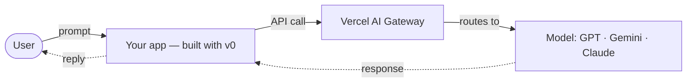

# Quick Start

Never built an AI app? Start here. You'll have a live app before you write real code.

## You only build the top bit

An AI app has layers: your application, an optional workflow or agent, a model-access layer, and the provider that runs the model. **You mainly build the application and its behavior.** Vercel hosts the app, AI Gateway authenticates and routes supported model requests, and the selected provider runs the model.

Here's the whole request flow — what happens when someone uses your app:

You build the app on the left. Gateway model IDs are easy to change, but models have different capabilities, settings, latency, and cost, so test a change before treating it as a drop-in replacement.

## Before the hackathon (~1 hour)

1. Create a **[Vercel account](https://vercel.com/signup)** and a **[v0](https://v0.app)** account.
2. For local development, get an **AI Gateway API key** — Vercel deployments can use OIDC automatically. See [AI SDK guide](ai-sdk-guide.md#get-a-model-key).
3. Build one tiny app in **[v0](https://v0.app)** and deploy it. That's the whole loop.

## Your first hour

1. Pick a scoped idea from [Challenges](challenges.md).
2. Copy a small example or clone a matching starter — see [starter templates](ai-sdk-guide.md#starter-templates).
3. Deploy it and open the live URL in a private/incognito window to confirm it works.

## Your first day

- Replace the template's content and logic with your idea.
- Add **one** thing that makes it useful: a tool call or a data source ([AI SDK guide](ai-sdk-guide.md)).
- Keep scope tight — aim to demo ~25% of the big idea, done well.

## Make it visible to judges

Judges need your **live URL** and to **see the code**, so deploy your app and put it on GitHub as a **public** repo (or share your v0 project link). Both easy paths start on v0 — the same two ways as the [Start building](/start-building) page:

- **All on v0 + Vercel (no local setup)** — build in [v0](https://v0.app), deploy for a live URL, then use the current Git controls to connect and push to the intended public repo.
- **Start on v0, then refine locally** — build in v0, connect the intended GitHub repo, pull it to your machine, and publish from Vercel when you're ready.

The exact Git labels can change, so confirm the full `owner/repo` name before syncing. The [Deployment guide](deployment-guide.md) covers current account and repository restrictions.

Pushing to GitHub also **backs up your work** — do it early and keep pushing, so a closed tab or spent credits never costs you the project.

Keep secrets out of a public repo — never commit `.env.local` or keys. More in the [Deployment guide](deployment-guide.md).

## The one rule

Deploy early and often. A live URL that does one thing beats a perfect app on your laptop.

It's 2 weeks, part-time: **deploy something small in week 1, then improve it in week 2.** Don't wait until it's "ready" to ship.

Stuck? See the [FAQ](faq.md), or ask in the [🆘 Help](https://teams.microsoft.com/l/channel/19%3A04b6a2068e4248bd85e0c34288a4d4e5%40thread.tacv2/%F0%9F%86%98%20Help?groupId=e292c5cf-9c44-4ee6-ace4-bc4bbfa60d6c&tenantId=76a2ae5a-9f00-4f6b-95ed-5d33d77c4d61) channel.
